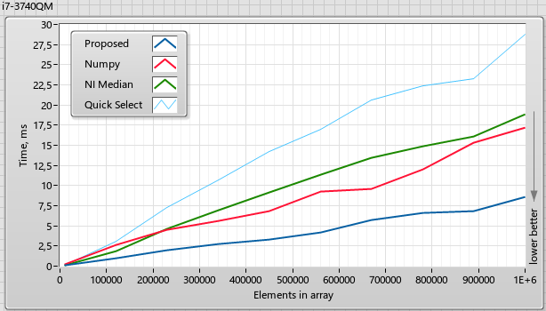

# fastMed
Fast Median search algorithm, based on histograms.

General idea is to split 8 byte doubles into 4 words using IEEE 754 representation, then perform 4 passes on 16 bits histograms.

| |0,6892|0,4535|0,2021|0,5425|0,8748|0,9152|0,5189|0,9152|
| ---- | ---- | ---- | ---- | ---- | ---- | ---- | ---- | ---- |
|1.Pass|0x3FE6|0x3FDD|0x3FC9|0x3FE1|0x3FEB|0x3FED|0x3FE0|0x3FBA|
|2.Pass|0x0E1B|0x060B|0xDD03|0x5C47|0xFE69|0x4908|0x9A92|0xF53F|
|3.Pass|0x2C33|0x1B8A|0x8645|0x9DA4|0x9980|0xCABF|0xE1A2|0x9401|
|4.Pass|0xBCD5|0x6004|0x3DC0|0x9E04|0x7CAF|0x511E|0xCB68|0xA3C0|

Comparizon:



The code is compiled to libMEd.dll, which can be called from Python:

```python
import os
import numpy as np
from random import random
from time import time
from ctypes import CDLL, POINTER, byref, c_size_t, c_double

mylib = CDLL(os.path.dirname(os.path.abspath(__file__)) + os.path.sep + "libMed.dll")
ND_POINTER_1 = np.ctypeslib.ndpointer(dtype=np.float64, ndim=1, flags="C")
mylib.MedianDBL.argtypes = [ND_POINTER_1, c_size_t, POINTER( c_double )]
mylib.MedianDBL.restype = np.int32
# Test Data
T1M = np.array([random() for _ in range(1024*1024+1)])
T4M = np.array([random() for _ in range(2048*2048+1)])
T16M = np.array([random() for _ in range(4096*4096+1)])
MyRes = c_double( 0.0 )

start = time()
for x in range(10):mylib.MedianDBL(T1M, T1M.size, byref(MyRes))
print ("Histo 1M:", (time() - start)*100, "ms; res = ", MyRes)
                  
start = time()          
for x in range(10):NumpyRes = np.median(T1M)
print ("Numpy 1M:", (time() - start)*100, "ms; res = ", NumpyRes)
if (MyRes == NumpyRes): print("passed")

```

Results:

```
>python fastMedTest.py
Histo 1M: 4.491758346557617 ms; res =  c_double(0.499818880337627)
Numpy 1M: 9.374451637268066 ms; res =  0.499818880337627
passed
Histo 4M: 19.92053985595703 ms; res =  c_double(0.4997365269430648)
Numpy 4M: 36.618852615356445 ms; res =  0.4997365269430648
passed
Histo 16M: 76.94809436798096 ms; res =  c_double(0.49984401332664263)
Numpy 16M: 126.45740509033203 ms; res =  0.49984401332664263
passed
```
Roughly twice faster than numpy.
